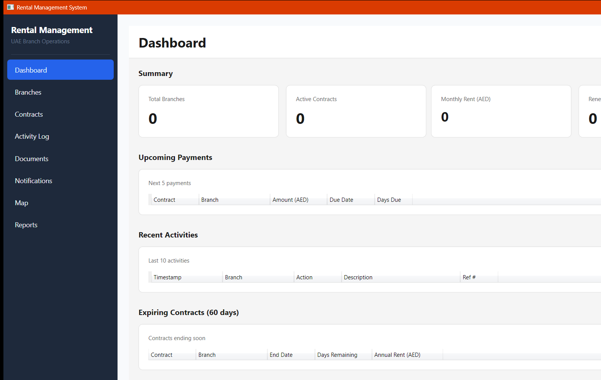
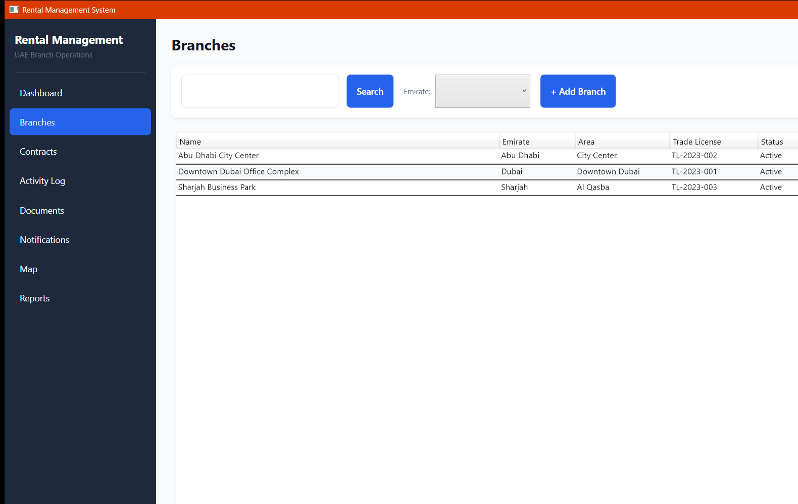
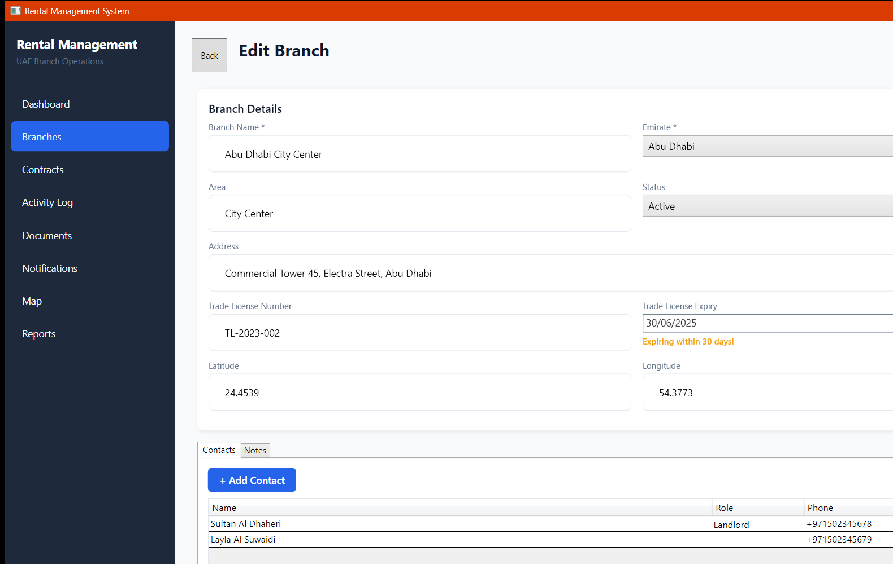
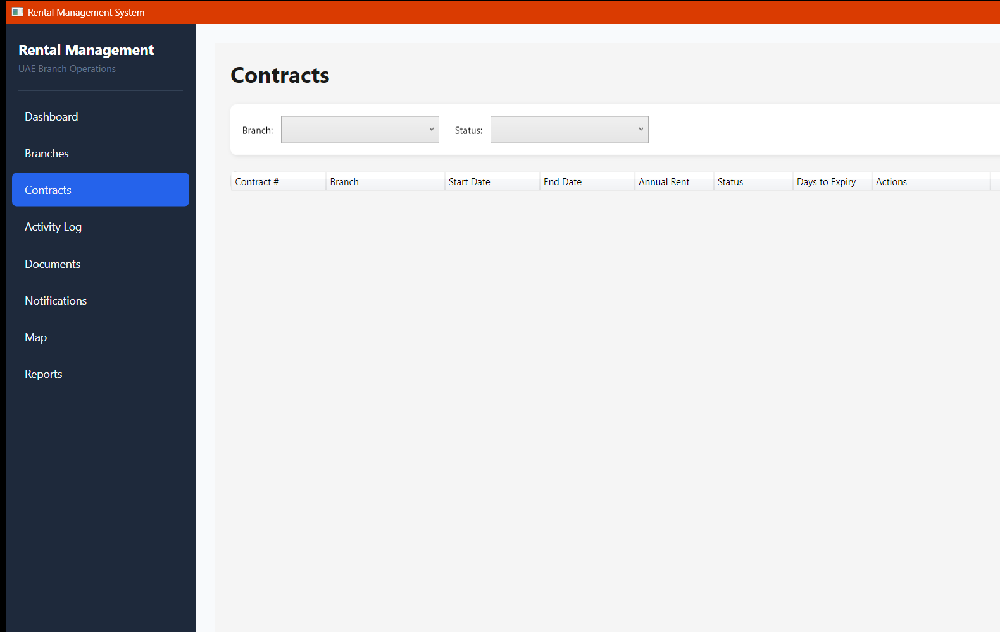
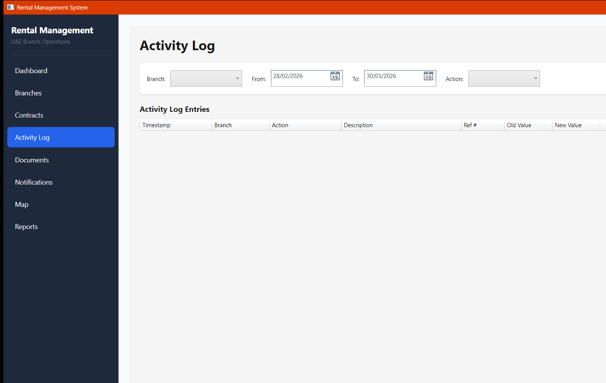
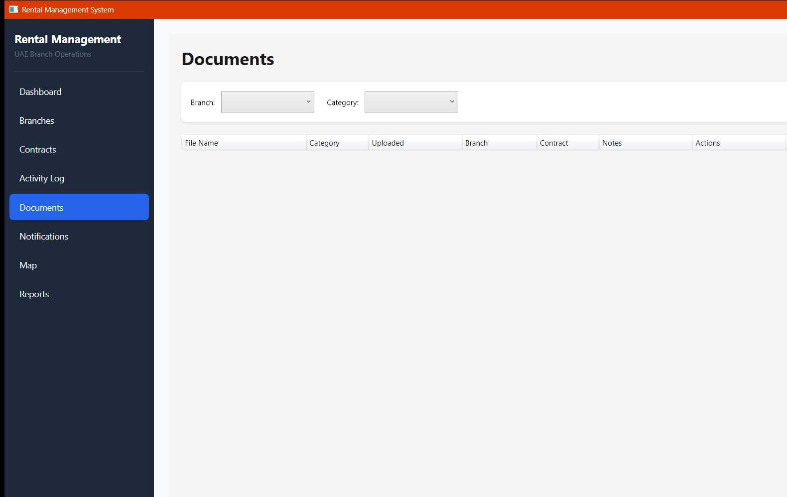
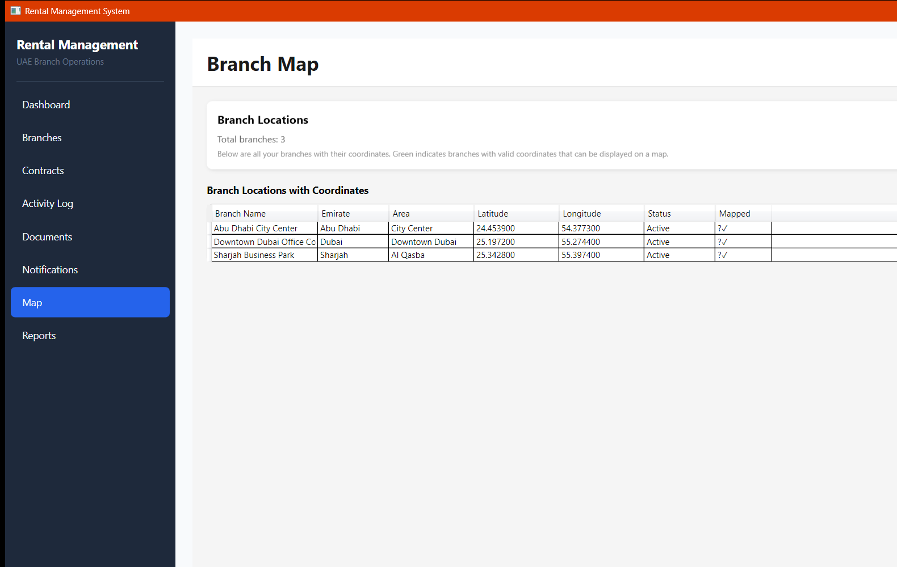
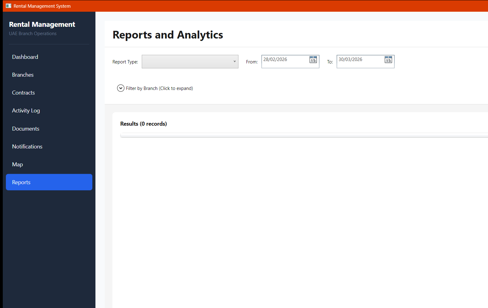
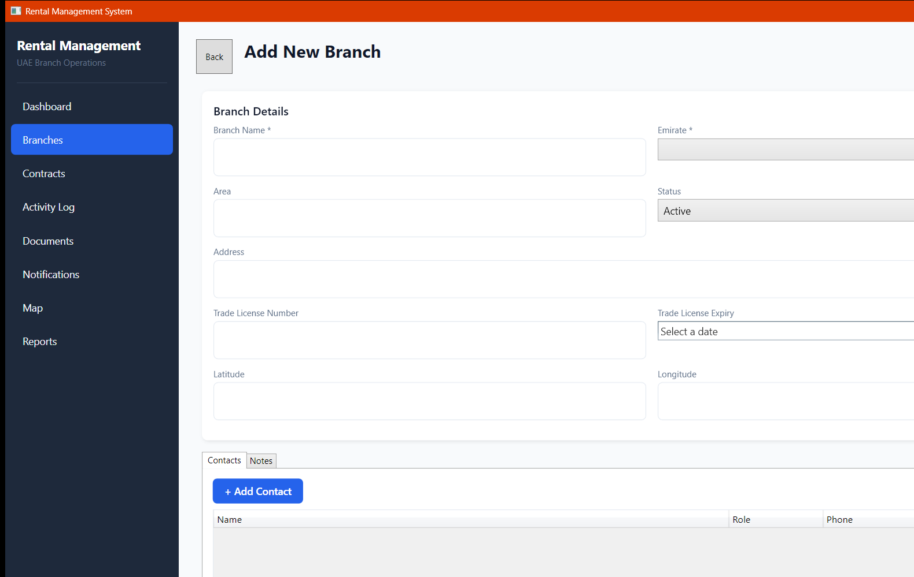

# 🏢 Rental Management System — User Guide

Welcome to the Rental Management System! This guide will help you use the application to manage your rental properties, contracts, and payments across multiple branches.

<!-- Workflow test: Verifying sync-docs workflow with explicit paths filter -->

## 📋 Table of Contents

- [What is This App?](#what-is-this-app)
- [Getting Started](#getting-started)
- [Main Dashboard](#main-dashboard)
- [Managing Branches](#managing-branches)
- [Managing Contracts](#managing-contracts)
- [Tracking Payments](#tracking-payments)
- [Managing Documents](#managing-documents)
- [Viewing Activity History](#viewing-activity-history)
- [Checking Notifications](#checking-notifications)
- [Viewing the Map](#viewing-the-map)
- [Creating Reports](#creating-reports)
- [FAQ & Troubleshooting](#faq--troubleshooting)

---

## What is This App?

The **Rental Management System** is a Windows desktop application designed to help you manage rental operations across multiple branches in the United Arab Emirates. It centralizes all your rental data in one place, helping you:

- 📍 Track multiple branch locations
- 🏢 Manage rental contracts with payment schedules
- 💰 Monitor payment status and upcoming due dates
- 📄 Store and organize contract documents
- 📊 Generate detailed reports and analytics
- 🔔 Receive automatic alerts for renewals and payments
- 🗺️ View all branches on an interactive map
- 📈 Track all changes with activity logs

---

## Getting Started

### Installation

1. **System Requirements:**
   - Windows 10 or Windows 11
   - SQL Server Express (or full SQL Server)
   - .NET 8 Runtime (installed with the app)

2. **First-Time Setup:**
   - Launch the application
   - The database will be created automatically on first run
   - Test data is already loaded for you to explore

3. **Starting the App:**
   - Double-click `RentalManagement.exe` to launch
   - The application window will open showing the Dashboard

---

## Visual Walkthrough — Screenshots

Here's what the application looks like as you navigate through it:

### Dashboard Overview

*Your command center showing summary cards, upcoming payments, recent activities, and expiring contracts.*

### Branches List View

*Manage all your branch locations with search, filter, and quick add options.*

### Branch Details

*View branch information, manage contacts, and add notes for each location.*

### Contracts List

*Track all rental agreements with status filtering and quick access to contract details.*

### Contract Details & Payment Schedule

*View full contract terms, payment schedule breakdown, and renewal options.*

### Activity Log

*Complete audit trail showing all contract changes, uploads, and system actions with timestamps.*

### Documents Management

*Upload and organize contract files, licenses, and agreements in one place.*

### Notifications Center

*Automatic alerts for contract renewals, upcoming payments, and license expiry dates.*

### Map View

*Geographic view of all your branch locations marked on an interactive map.*

### Reports & Analytics

*Generate detailed reports on rental costs, renewals, payments, and activities with Excel export.*

### Add Branch Form

*Create new branches with location, trade license, and GPS coordinate information.*

---

## Main Dashboard

When you open the app, you'll see the **Dashboard** — your command center with a quick overview of your entire operation.

**What You See:**

1. **Summary Cards** (Top Row)
   - **Total Branches**: How many branch locations you manage
   - **Active Contracts**: Number of active rental agreements
   - **Monthly Rent**: Total monthly rental income in AED
   - **Renewals (30 days)**: How many contracts expire in the next 30 days

2. **Upcoming Payments**: The next 5 payments due with days remaining

3. **Recent Activities**: Last 10 actions logged in the system

4. **Expiring Contracts**: Contracts ending within 60 days that need renewal

5. **Notifications**: Unread alerts about renewals, payments, and license expiries

---

## Managing Branches

Branches represent your office locations across the UAE.

### Viewing All Branches

1. Click **"Branches"** in the sidebar
2. You'll see a list of all your branch locations
3. Search by name or filter by emirate (Dubai, Abu Dhabi, Sharjah, etc.)

### Adding a New Branch

1. Click **"+ Add Branch"** button
2. Fill in the details:
   - **Branch Name** - e.g., "Downtown Dubai Office Complex"
   - **Emirate** - Select from dropdown (Dubai, Abu Dhabi, Sharjah, etc.)
   - **Area** - Specific area within emirate
   - **Address** - Full street address
   - **Trade License Number** - Your business license number
   - **Trade License Expiry** - When your license expires
   - **Latitude/Longitude** - GPS coordinates for map display

3. Click **"Save"** to create the branch

### Editing a Branch

1. Double-click on any branch in the list
2. The branch details form will open
3. Update any information
4. Click **"Save"** to apply changes or **"Cancel"** to discard

### Adding Contacts to a Branch

When viewing a branch detail:

1. Go to the **"Contacts"** tab
2. Click **"+ Add Contact"**
3. Enter contact information:
   - **Name** - Person's name
   - **Role** - Landlord, Agent, or Manager
   - **Phone** - Contact number
   - **Email** - Email address
4. Click **"Save"**

### Adding Notes to a Branch

When viewing a branch detail:

1. Go to the **"Notes"** tab
2. Click **"+ Add Note"**
3. Type your note (e.g., "Renewed license on 15/03/2026")
4. Click **"Save"**

---

## Managing Contracts

Contracts are your rental agreements with specific terms and payment schedules.

### Viewing All Contracts

1. Click **"Contracts"** in the sidebar
2. See all contracts with their status (Active, Renewed, Cancelled)
3. Filter by status or branch location

### Creating a New Contract

1. Click **"+ Create Contract"**
2. Select the branch from dropdown
3. Enter contract details:
   - **Contract Number** - e.g., "BR-001" (your naming format)
   - **Start Date** - When the contract begins
   - **End Date** - When the contract expires
   - **Annual Rent** - Total yearly rental amount in AED
   - **Number of Payments** - How often you receive payment (1, 2, 4, 12)
   - **Free Rent Days** - Initial free period (if any)
   - **Security Deposit** - Security deposit amount
4. Click **"Generate Schedule"** (payment schedule is auto-created)
5. Click **"Save"**

**Example**: 300,000 AED annual rent, 12 monthly payments → 25,000 AED per month

### Payment Schedule

When you create a contract, the system automatically calculates all payment dates and amounts.

**Auto-Generated Schedule Example:**
- Contract: 300,000 AED, 12 payments
- Each payment: 25,000 AED
- First payment: Start date + free rent days
- Remaining 11 payments: Evenly spaced throughout contract period

### Viewing Contract Details

1. Double-click a contract in the list
2. See the full payment schedule

### Renewing a Contract

When a contract is about to expire:

1. Open the contract
2. Click **"Renew Contract"**
3. Set new terms:
   - New annual rent (optional)
   - New start date (next day after current end)
   - New end date (usually 1 year later)
4. Click **"Confirm"** → System creates new contract and marks old as "Renewed"

### Cancelling a Contract

If you need to terminate early:

1. Open the contract
2. Click **"Cancel Contract"**
3. Provide a reason
4. Click **"Confirm"** → Contract marked as "Cancelled"

---

## Tracking Payments

### Viewing Payment Status

1. Click **"Contracts"** → Open a contract
2. See the payment schedule table
3. **Green checkmark** = Paid ✓
4. **Red X** = Unpaid ✗

### Recording a Payment

When you receive a payment:

1. Find the payment in the schedule
2. Click on the payment row to edit
3. Change status to **"Paid"**
4. Enter **Payment Date** (when you received it)
5. Enter **Payment Method** (Bank Transfer, Cheque, Cash, etc.)
6. If paying by cheque: Enter **Cheque Number**
7. Click **"Save"**

### Payment Status Report

For a complete payment overview:

1. Click **"Reports"** in sidebar
2. Select **"Payment Status"** report type
3. Choose date range (optional)
4. Click **"Generate"**
5. View:
   - Total payments due
   - Paid vs unpaid amounts
   - Outstanding balance
   - Payment percentage

---

## Managing Documents

Store important contract documents, licenses, and agreements.

### Uploading Documents

1. Click **"Documents"** in sidebar
2. Click **"+ Upload Document"**
3. Select file from your computer (PDF, Word, Excel, etc.)
4. Choose document category:
   - **Lease Agreement** - The main contract
   - **Trade License** - Business license copy
   - **Contract Terms** - Additional terms
   - **Other** - Any other document
5. Add optional notes (e.g., "Signed version, 15/03/2026")
6. Click **"Upload"**

### Viewing Documents

Documents are organized by branch and contract.

### Opening a Document

1. Find document in list
2. Click **"Open"** button
3. Document opens in your default application (PDF reader, Word, etc.)

### Deleting a Document

1. Right-click on document
2. Click **"Delete"**
3. Confirm deletion
4. Document removed from system

---

## Viewing Activity History

All system actions are automatically logged for compliance and audit purposes.

### Activity Log Features

Click **"Activity Log"** in sidebar to see a timestamped list of all actions with filtering by action type and date range.

**What Gets Logged:**
- ✓ Contract creation, renewal, cancellation
- ✓ Payment receipts
- ✓ Document uploads
- ✓ Branch updates
- ✓ Manual notes added

**Filter Options:**
- **By Action**: Contract Renewal, Payment, Document Upload, etc.
- **By Date Range**: Select "From" and "To" dates
- **By Branch**: Show logs for specific branch only

---

## Checking Notifications

The system automatically alerts you about important events.

### Types of Notifications

1. **🔄 Contract Renewal** - Contract ending soon, needs renewal
2. **💰 Payment Due** - Payment is due or overdue
3. **⚠️ License Expiry** - Trade license expiring soon

### Viewing Notifications

1. Click **"Notifications"** in sidebar
2. See all unread alerts with counts
3. Click notification to jump to related contract/branch

### Marking as Read

1. Click notification
2. Click **"Mark as Read"**
3. Notification disappears from unread list

### Auto-Checking

The system checks for new notifications every 15 minutes automatically:
- **Renewals**: Contracts ending within 30 days
- **Payments**: Unpaid payments due within 7 days
- **License Expiry**: Licenses expiring within 30 days

---

## Viewing the Map

See all your branch locations on an interactive map.

### Opening the Map

1. Click **"Map"** in sidebar
2. Map displays all branches with green pins
3. Each pin shows branch name and location

**Map Features:**
- 🟢 Green pins = Branch locations
- 📍 Hover pin = See branch name
- 🔍 Zoom in/out to see specific areas
- Shows all branches with GPS coordinates

### Understanding Map Pins

Each green pin represents one branch:
- **Downtown Dubai** - Downtown Dubai Office Complex
- **Abu Dhabi** - Abu Dhabi City Center
- **Sharjah** - Sharjah Business Park

**Click a pin** to navigate to that branch's detail page.

---

## Creating Reports

Generate detailed analytics and export to Excel for further analysis.

### Available Reports

1. **Rental Cost Summary**
   - Total rent by branch
   - Monthly vs annual breakdown
   - Compare across date ranges

2. **Upcoming Renewals**
   - Contracts ending soon
   - Renewal dates at a glance
   - Plan renewal strategy

3. **Payment Status**
   - Paid vs unpaid payments
   - Outstanding balances
   - Payment percentages per branch

4. **Activity History**
   - All logged actions in date range
   - Filter by action type
   - Audit trail for compliance

5. **Branch Overview**
   - Active contracts per branch
   - Total rent per location
   - Performance metrics

### Generating a Report

1. Click **"Reports"** in sidebar
2. Choose report type from dropdown
3. Set optional filters:
   - **Date Range**: From and To dates
   - **Branch(es)**: Select one or multiple branches
4. Click **"Generate"**
5. View results in table format

### Exporting to Excel

1. After generating report
2. Click **"Export to Excel"**
3. File saves to your Desktop with timestamp
4. Opens automatically in Excel

**Excel Export Includes:**
- ✓ Formatted headers
- ✓ Proper column widths
- ✓ Number formatting (with thousand separators)
- ✓ Date formatting (dd/MM/yyyy)
- ✓ Totals and calculations

### Example Reports

---

## FAQ & Troubleshooting

### Common Questions

**Q: How do I backup my data?**
A: The application uses SQL Server for secure storage. Ask your IT team to backup the database regularly.

**Q: Can multiple people use this at the same time?**
A: Yes! Multiple staff members can access the application simultaneously. All changes are stored in the central database.

**Q: What if I make a mistake entering data?**
A: You can edit almost anything. Open the record, make changes, and click Save. Activity Log shows all changes for audit purposes.

**Q: Can I export all my data?**
A: Yes, through the Reports feature. Generate any report and export to Excel. Contact your IT team for full database exports.

**Q: How are payments scheduled automatically?**
A: When you create a contract, the system calculates payment dates evenly throughout the contract period, accounting for any free rent days.

**Q: What happens when a contract expires?**
A: You'll get a notification 30 days before. You can then renew it (creating a new contract) or let it expire if not renewing.

**Q: How do I record rent received?**
A: Go to Contracts → Payment Schedule → Find the payment → Click Edit → Change to "Paid" → Enter payment date and method → Save.

### Troubleshooting

**Problem: "Unknown" showing in Branch column**
- **Solution**: Restart the application. This forces a data refresh.

**Problem: Notification not appearing**
- **Solution**: Notifications update every 15 minutes. Wait a moment or check manually by clicking Notifications tab.

**Problem: Excel export not opening**
- **Solution**: Check your Desktop folder. Look for file named like "Report_2026-03-30_14-30.xlsx"

**Problem: Cannot edit a field**
- **Solution**: Some fields are read-only. Try a different field or click Edit/Save buttons to enter edit mode.

**Problem: Application running slowly**
- **Solution**: Close unused browser windows and applications. Restart the application if it still lags.

### Getting Help

If you encounter issues:

1. **Check Activity Log** - See what happened just before the problem
2. **Review Notifications** - May contain helpful information
3. **Restart Application** - Simple but effective for most issues
4. **Contact Your IT Team** - For database or system-level issues

---

## Tips for Success

✅ **Enter contracts as soon as agreed** - Don't wait, enter immediately
✅ **Upload documents promptly** - Keep digital copies safe in the system
✅ **Record payments immediately** - Mark payments as soon as received
✅ **Check dashboard daily** - Stay aware of upcoming deadlines
✅ **Review activity log weekly** - Ensure all actions are properly logged
✅ **Export reports monthly** - Keep records for your financial reporting
✅ **Update licenses before expiry** - Set reminders based on notifications

---

## Summary

You now know how to:
- View your rental operation dashboard
- Manage branches and contacts
- Create and track contracts
- Monitor payment schedules
- Store documents securely
- Review all activities
- Receive automatic notifications
- View branches on a map
- Generate detailed reports

For questions about specific features, refer to the relevant section above. The system is designed to be intuitive, but don't hesitate to explore and ask for help when needed!

-----

**Enjoy managing your rental operations efficiently! 🎉**
